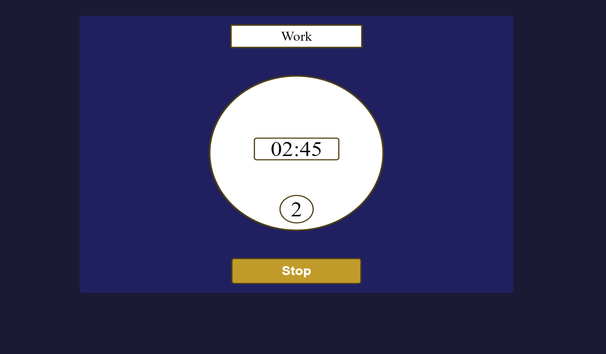
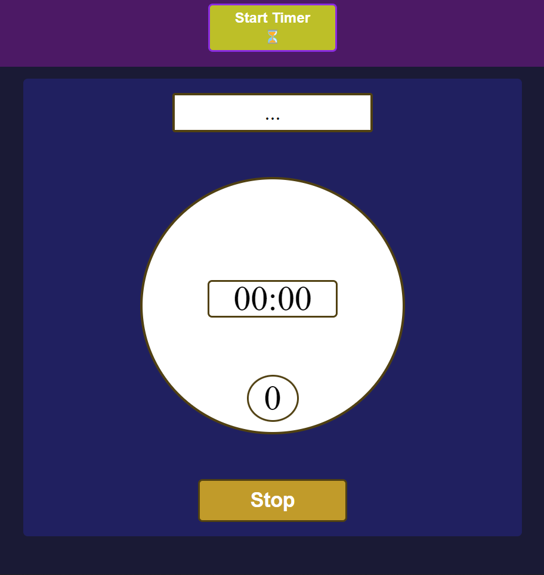

# Pomodoro JS

## Screenshots

</img>
</img>

## Description

A JavaScript application that allows you to set your own pomodoro-style timers they you want to them to be

**Features:**

- Modern User Interface
- Intuitive Design
- Reverse-Countdown Timer
- Timer Profiles

## What I've Learnt

- Working with forms
- Handling user-submission data
- Creating and using timer objects

## Installation

To use this project, first clone the repo on your device using the command below:

`git init`

`https://github.com/tarwat-uddin/pomo-doro-js.git`

## License

[GNU General Public License version 3](https://opensource.org/licenses/GPL-3.0)
